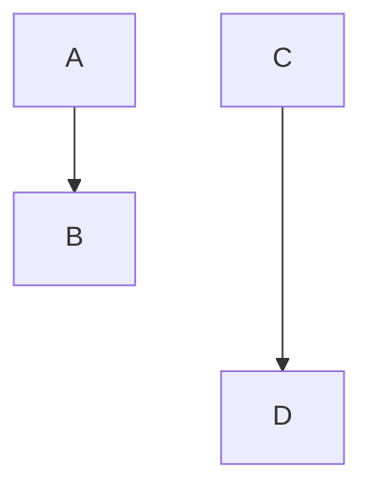

# Markdown Syntax Example
## Headings
# H1 Heading
## H2 Heading
### H3 Heading
#### H4 Heading
##### H5 Heading
###### H6 Heading

## Text Formatting
**Bold Text**  
*Italic Text*  
***Bold Italic Text***
~~Strikethrough~~  
`Inline Code`
==highlight==

## Lists
### Unordered List
- Item 1
- Item 2
  - Sub-item 1
  - Sub-item 2
- Item 3

### Ordered List
1. First item
2. Second item
3. Third item

## Links
[OpenAI](https://openai.com)

## Images


## Blockquotes
> This is a blockquote.
> It can span multiple lines.

## Code Blocks
```python
# This is a Python code block
def hello():
    print("Hello, World!")
```

## Tables
| Column 1 | Column 2 | Column 3 |
|----------|----------|----------|
| Data 1   | Data 2   | Data 3   |
| Data 4   | Data 5   | Data 6   |

## Horizontal Rule

---

## Task Lists
- [x] Task 1
- [ ] Task 2
- [ ] Task 3

## Emoji
:smile: :rocket: :tada:

## Footnotes
Here is a sentence with a footnote.[^1]

[^1]: This is the footnote text.

## Obsidian specific
>[!info]
>Call out block

>[!tip]
>Call out block

> [!question] Can callouts be nested?
> > [!todo] Yes!, they can.
> > > [!example]  You can even use multiple layers of nesting.


